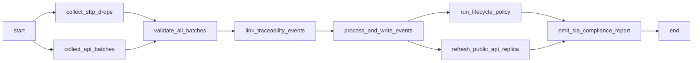

# Walkthrough: MoIT Batch Architecture Deliverables

## Summary
Built a complete project scaffold and documentation suite for the **MoIT National Food Traceability Hub** using a batch-based "Validated Data Lake" architecture, ready for implementation.

---

## Deliverables Created

### 1. Project Root: [README.md](file:///d:/09_Workspace/Traceability_VN/README.md)
[README.md](file:///d:/09_Workspace/Traceability_VN/README.md)

Bilingual (Vietnamese + English) documentation covering:
- Problem context, business constraints (24h SLA, 5-year retention)
- Full ASCII architecture overview
- Detailed breakdown of all 3 layers (Ingestion → Processing → Storage)
- Core SQL data model, project folder structure, and 4-week MVP plan

---

### 2. Interactive Architecture Diagram
[batch_architecture.html](file:///d:/09_Workspace/Traceability_VN/architecture/batch_architecture.html)

Dark-mode, interactive HTML diagram. Open in any browser — no dependencies required.

````carousel

<!-- slide -->

````

**Visual sections:**
| Section | Content |
|---|---|
| **Ingestion Layer** (blue) | SFTP/S3 · Bulk API · Web Portal |
| **Processing Layer** (purple) | Validation Engine · Traceability Linker · Event Processor |
| **Storage & Serving Layer** (green) | Hot Storage (12m) · Cold Archive (60m) · Public API |
| **24-Hour Timeline** | 06:00 PM event → 06:00 AM Public API availability |
| **Tech Stack Grid** | Airflow · Pydantic · PostgreSQL · MinIO · FastAPI · OAuth2 · Grafana |

---

### 3. Airflow DAG
[moit_traceability_batch.py](file:///d:/09_Workspace/Traceability_VN/orchestration/dags/moit_traceability_batch.py)

7-stage daily pipeline (schedules at 00:00 ICT = 17:00 UTC):



---

### 4. Pydantic Validation Schemas
[schemas.py](file:///d:/09_Workspace/Traceability_VN/processing/validation/schemas.py)

- [TraceabilityEventIn](file:///d:/09_Workspace/Traceability_VN/processing/validation/schemas.py#36-78) — enforces 4 mandatory fields + event type
- [BatchSubmissionIn](file:///d:/09_Workspace/Traceability_VN/processing/validation/schemas.py#84-103) — batch envelope with ≤500 events, idempotency key, single-actor guard
- [QuarantinedRecord](file:///d:/09_Workspace/Traceability_VN/processing/validation/schemas.py#119-124) — schema for failed-validation records

---

### 5. PostgreSQL Migration
[001_initial_schema.sql](file:///d:/09_Workspace/Traceability_VN/storage/migrations/001_initial_schema.sql)

7 database objects:
| Object | Purpose |
|---|---|
| `establishments` | Registered businesses with OAuth2 + digital cert |
| `products` | Product catalog linked to establishments |
| `ingestion_batches` | Per-batch audit trail with status tracking |
| `traceability_events` | Hot storage with `prev_event_id`/`next_event_id` chain |
| `quarantined_records` | Invalid records awaiting correction |
| `mv_public_trace_lookup` | Consumer-facing materialized view |
| `set_updated_at()` trigger | Auto-maintain `updated_at` timestamps |

---

## Architecture Compliance Check

| Constraint | Solution | Status |
|---|---|---|
| **24h update SLA** | Airflow DAG runs 00:00–06:00, cut-off 23:59 | ✅ |
| **5-year retention** | Lifecycle: Hot (12m) → Cold MinIO (48m) → Delete | ✅ |
| **One-before/One-after** | `prev_event_id`/`next_event_id` FK chain + Linker | ✅ |
| **Plug-and-Play** | SFTP · Bulk API · Web Portal — 3 ingestion tiers | ✅ |
| **Legal verification** | OAuth2 + Digital Signatures on all batch submissions | ✅ |
